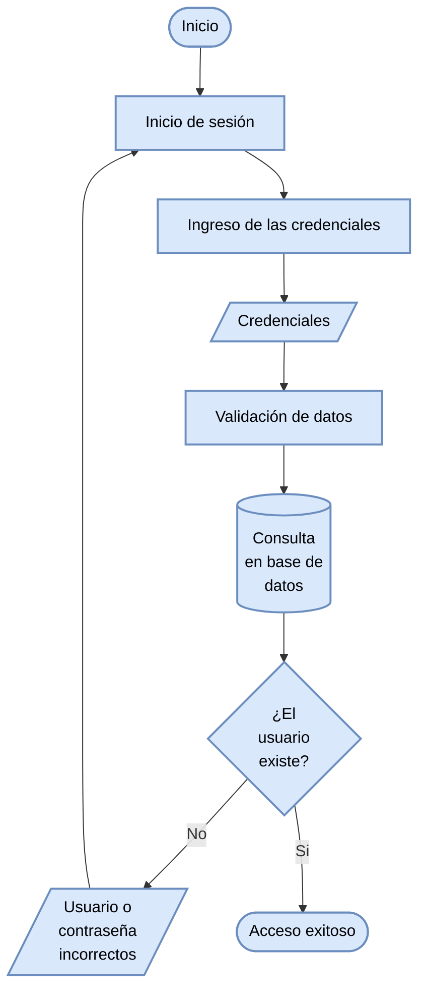

#### Diagrama de flujo: Inicio de Sesión

Este diagrama representa el algoritmo de validación para que un alumno o docente ingrese a la plataforma, basado en el flujo de verificación de credenciales.

