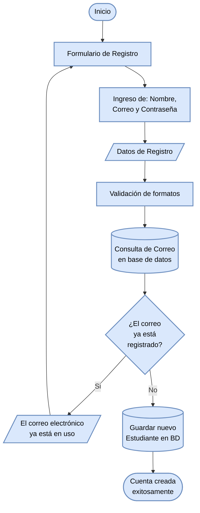

#### Diagrama de flujo: Registro de Nuevo Usuario (Estudiante)

Flujo para la creación de una cuenta en DebiHaby, incluyendo la validación de que el correo no esté duplicado en el sistema.

```mermaid
flowchart TD
    Inicio([Inicio]) --> Formulario[Formulario de Registro]
    Formulario --> Ingreso[Ingreso de: Nombre, <br> Correo y Contraseña]
    Ingreso --> DatosFormulario[/Datos de Registro/]
    DatosFormulario --> ValidarFormatos[Validación de formatos]
    ValidarFormatos --> ConsultaCorreo[(Consulta de Correo <br> en base de datos)]
    ConsultaCorreo --> Decision{¿El correo <br> ya está <br> registrado?}
    Decision -- Si --> Error[/El correo electrónico <br> ya está en uso/]
    Error --> Formulario
    Decision -- No --> Registrar[(Guardar nuevo <br> Estudiante en BD)]
    Registrar --> Exito([Cuenta creada <br> exitosamente])

    %% Estilo general tipo Visio/DIA
    classDef default fill:#dae8fc,stroke:#6c8ebf,stroke-width:2px,color:#000;
```
