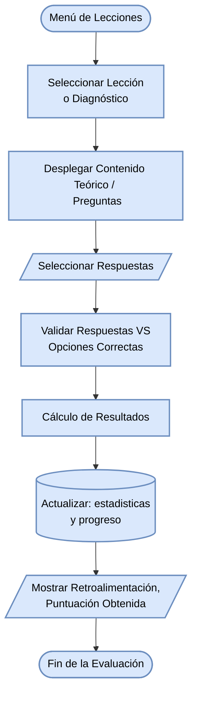

#### Diagrama de flujo: Aprendizaje Teórico (Lecciones y Diagnóstico)

Representa cómo un estudiante interactúa con la parte teórica del sistema, respondiendo un cuestionario diagnóstico y obteniendo retroalimentación (Gamificación).

