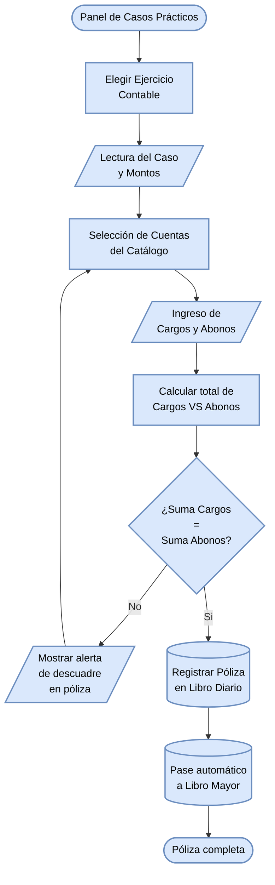

#### Diagrama de flujo: Práctica Contable Interactiva (Pólizas y Libro Diario)

Es el algoritmo principal de funcionalidad práctica; asegura que cada asiento que realiza el alumno cumpla con la regla de la Partida Doble antes de procesar la póliza e impactar los libros.

