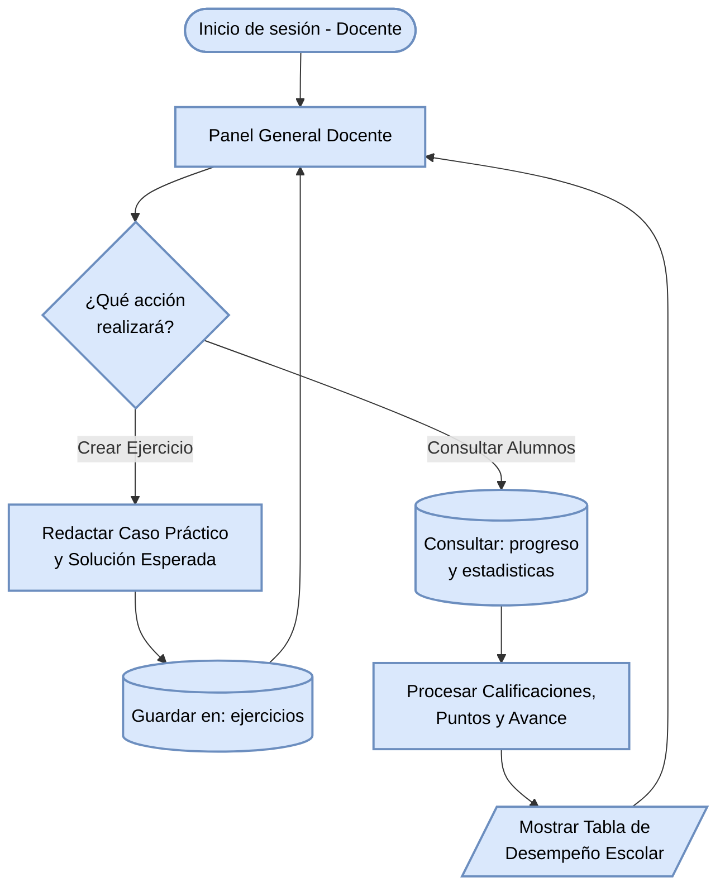

#### Diagrama de flujo: Panel Docente (Gestión y Reportes)

Flujo de las operaciones principales de un profesor: asignar tareas y supervisar el avance de los estudiantes.

```mermaid
flowchart TD
    Inicio([Inicio de sesión - Docente]) --> Dashboard[Panel General Docente]
    Dashboard --> Accion{¿Qué acción <br> realizará?}

    Accion -- Crear Ejercicio --> Formulacion[Redactar Caso Práctico <br> y Solución Esperada]
    Formulacion --> CargaBD[(Guardar en: ejercicios)]
    CargaBD --> Dashboard

    Accion -- Consultar Alumnos --> Peticion[(Consultar: progreso <br> y estadisticas)]
    Peticion --> GenerarReporte[Procesar Calificaciones, <br> Puntos y Avance]
    GenerarReporte --> Desplegar[/Mostrar Tabla de <br> Desempeño Escolar/]
    Desplegar --> Dashboard

    %% Estilo general tipo Visio/DIA
    classDef default fill:#dae8fc,stroke:#6c8ebf,stroke-width:2px,color:#000;
```
