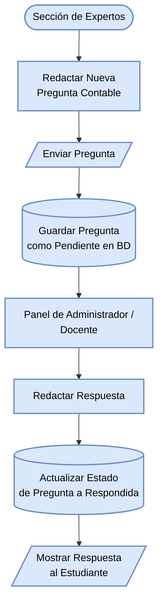

#### Diagrama de flujo: Panel de Consulta a Expertos (Asesoría)

Flujo que permite a los estudiantes realizar preguntas contables que serán respondidas por los administradores o docentes expertos.

