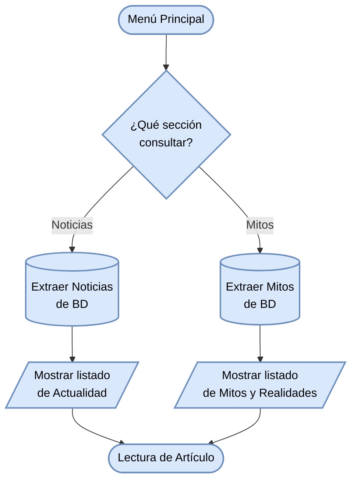

#### Diagrama de flujo: Sección Informativa (Noticias y Mitos)

Representa el flujo de consulta de material de apoyo secundario como actualidad fiscal o mitos financieros.

```mermaid
flowchart TD
    Inicio([Menú Principal]) --> Seleccionar{¿Qué sección <br> consultar?}
    Seleccionar -- Noticias --> ConsultaNoticias[(Extraer Noticias <br> de BD)]
    Seleccionar -- Mitos --> ConsultaMitos[(Extraer Mitos <br> de BD)]
    ConsultaNoticias --> MostrarN[/Mostrar listado <br> de Actualidad/]
    ConsultaMitos --> MostrarM[/Mostrar listado <br> de Mitos y Realidades/]
    MostrarN --> Leer([Lectura de Artículo])
    MostrarM --> Leer

    %% Estilo general tipo Visio/DIA
    classDef default fill:#dae8fc,stroke:#6c8ebf,stroke-width:2px,color:#000;
```
