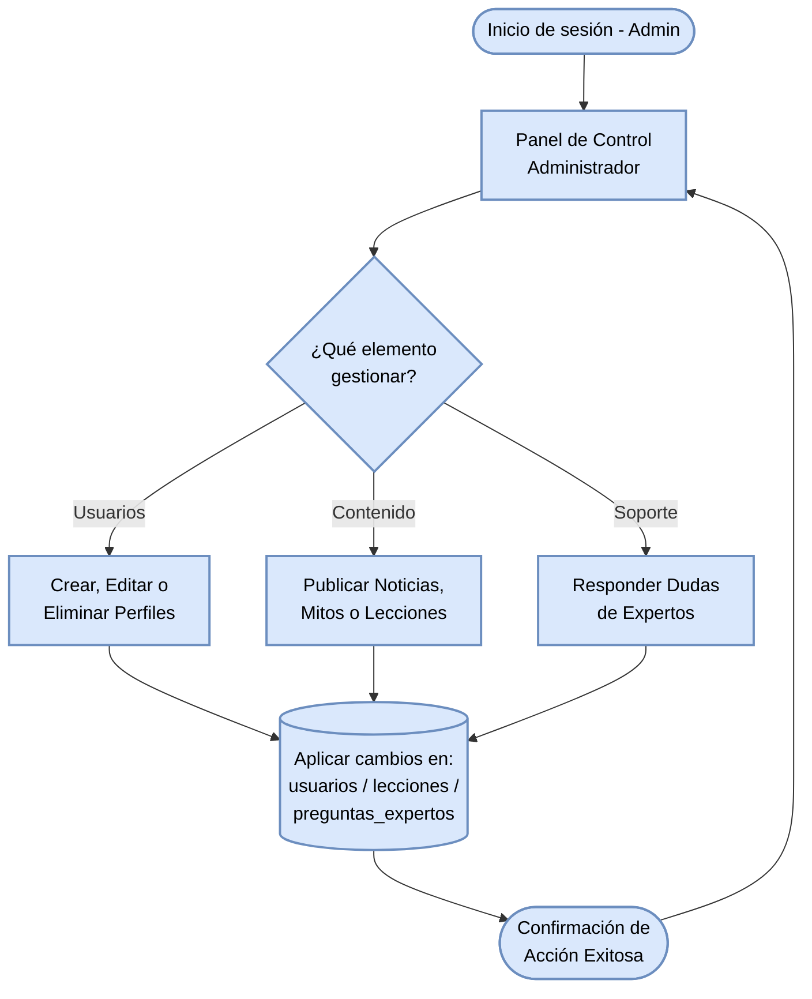

#### Diagrama de flujo: Panel de Administrador (Gestión del Sistema)

Flujo de las operaciones principales de un administrador: gestionar el contenido y las cuentas de usuarios de la plataforma DebiHaby.

