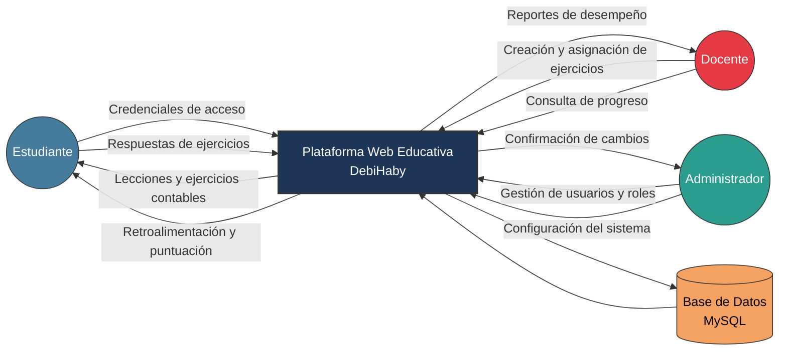

```mermaid
flowchart LR

%% Actores
Estudiante((Estudiante))
Docente((Docente))
Admin((Administrador))

%% Sistema
Sistema[Plataforma Web Educativa<br>DebiHaby]

%% Base de datos
BD[(Base de Datos<br>MySQL)]

%% Interacciones Estudiante
Estudiante -- Credenciales de acceso --> Sistema
Sistema -- Lecciones y ejercicios contables --> Estudiante
Estudiante -- Respuestas de ejercicios --> Sistema
Sistema -- Retroalimentación y puntuación --> Estudiante

%% Interacciones Docente
Docente -- Creación y asignación de ejercicios --> Sistema
Docente -- Consulta de progreso --> Sistema
Sistema -- Reportes de desempeño --> Docente

%% Interacciones Administrador
Admin -- Gestión de usuarios y roles --> Sistema
Admin -- Configuración del sistema --> Sistema
Sistema -- Confirmación de cambios --> Admin

%% Base de datos
Sistema --> BD
BD --> Sistema

%% Estilos
style Sistema fill:#1d3557,stroke:#333,stroke-width:2px,color:#fff
style Estudiante fill:#457b9d,stroke:#333,color:#fff
style Docente fill:#e63946,stroke:#333,color:#fff
style Admin fill:#2a9d8f,stroke:#333,color:#fff
style BD fill:#f4a261,stroke:#333,color:#000
```
