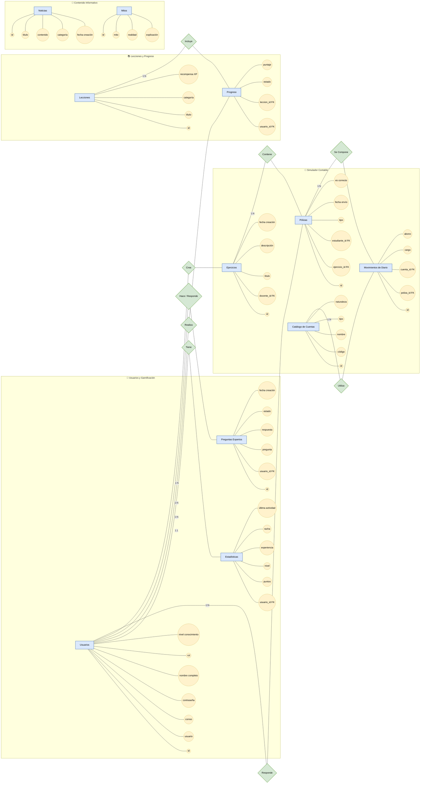

```mermaid
flowchart LR
    classDef entity fill:#dae8fc,stroke:#6c8ebf,stroke-width:2px,color:#000
    classDef relation fill:#d5e8d4,stroke:#82b366,stroke-width:2px,color:#000
    classDef attribute fill:#fff2cc,stroke:#d6b656,stroke-width:1px,color:#000

    %% ── SUBGRAPH: Usuarios y Gamificación ──
    subgraph SG_USER ["👤 Usuarios y Gamificación"]
        E_USUARIOS[Usuarios]:::entity
        E_ESTADISTICAS[Estadísticas]:::entity
        E_PREGUNTAS[Preguntas Expertos]:::entity

        A_U_ID((id)):::attribute
        A_U_USUARIO((usuario)):::attribute
        A_U_CORREO((correo)):::attribute
        A_U_CONTRASENA((contraseña)):::attribute
        A_U_NOMBRE((nombre completo)):::attribute
        A_U_ROL((rol)):::attribute
        A_U_NIVEL_C((nivel conocimiento)):::attribute

        A_E_UID((usuario_id FK)):::attribute
        A_E_PUNTOS((puntos)):::attribute
        A_E_NIVEL((nivel)):::attribute
        A_E_EXP((experiencia)):::attribute
        A_E_RACHA((racha)):::attribute
        A_E_ULTIMA((última actividad)):::attribute

        A_P_ID((id)):::attribute
        A_P_UID((usuario_id FK)):::attribute
        A_P_PREGUNTA((pregunta)):::attribute
        A_P_RESPUESTA((respuesta)):::attribute
        A_P_ESTADO((estado)):::attribute
        A_P_FECHA((fecha creación)):::attribute

        E_USUARIOS --- A_U_ID & A_U_USUARIO & A_U_CORREO & A_U_CONTRASENA & A_U_NOMBRE & A_U_ROL & A_U_NIVEL_C
        E_ESTADISTICAS --- A_E_UID & A_E_PUNTOS & A_E_NIVEL & A_E_EXP & A_E_RACHA & A_E_ULTIMA
        E_PREGUNTAS --- A_P_ID & A_P_UID & A_P_PREGUNTA & A_P_RESPUESTA & A_P_ESTADO & A_P_FECHA
    end

    %% ── SUBGRAPH: Lecciones y Progreso ──
    subgraph SG_LECCION ["📚 Lecciones y Progreso"]
        E_LECCIONES[Lecciones]:::entity
        E_PROGRESO[Progreso]:::entity

        A_L_ID((id)):::attribute
        A_L_TITULO((título)):::attribute
        A_L_CATEGORIA((categoría)):::attribute
        A_L_XP((recompensa XP)):::attribute

        A_PR_UID((usuario_id FK)):::attribute
        A_PR_LID((leccion_id FK)):::attribute
        A_PR_ESTADO((estado)):::attribute
        A_PR_PUNTAJE((puntaje)):::attribute

        E_LECCIONES --- A_L_ID & A_L_TITULO & A_L_CATEGORIA & A_L_XP
        E_PROGRESO --- A_PR_UID & A_PR_LID & A_PR_ESTADO & A_PR_PUNTAJE
    end

    %% ── SUBGRAPH: Simulador Contable ──
    subgraph SG_SIM ["🧾 Simulador Contable"]
        E_EJERCICIOS[Ejercicios]:::entity
        E_POLIZAS[Pólizas]:::entity
        E_MOVIMIENTOS[Movimientos de Diario]:::entity
        E_CATALOGO[Catálogo de Cuentas]:::entity

        A_EJ_ID((id)):::attribute
        A_EJ_TID((docente_id FK)):::attribute
        A_EJ_TITULO((título)):::attribute
        A_EJ_DESC((descripción)):::attribute
        A_EJ_FECHA((fecha creación)):::attribute

        A_PO_ID((id)):::attribute
        A_PO_EID((ejercicio_id FK)):::attribute
        A_PO_SID((estudiante_id FK)):::attribute
        A_PO_TIPO((tipo)):::attribute
        A_PO_FECHA((fecha envío)):::attribute
        A_PO_CORRECTO((es correcto)):::attribute

        A_MO_ID((id)):::attribute
        A_MO_PID((poliza_id FK)):::attribute
        A_MO_CID((cuenta_id FK)):::attribute
        A_MO_CARGO((cargo)):::attribute
        A_MO_ABONO((abono)):::attribute

        A_CA_ID((id)):::attribute
        A_CA_CODIGO((código)):::attribute
        A_CA_NOMBRE((nombre)):::attribute
        A_CA_TIPO((tipo)):::attribute
        A_CA_NATURALEZA((naturaleza)):::attribute

        E_EJERCICIOS --- A_EJ_ID & A_EJ_TID & A_EJ_TITULO & A_EJ_DESC & A_EJ_FECHA
        E_POLIZAS --- A_PO_ID & A_PO_EID & A_PO_SID & A_PO_TIPO & A_PO_FECHA & A_PO_CORRECTO
        E_MOVIMIENTOS --- A_MO_ID & A_MO_PID & A_MO_CID & A_MO_CARGO & A_MO_ABONO
        E_CATALOGO --- A_CA_ID & A_CA_CODIGO & A_CA_NOMBRE & A_CA_TIPO & A_CA_NATURALEZA
    end

    %% ── SUBGRAPH: Contenido Informativo ──
    subgraph SG_INFO ["📰 Contenido Informativo"]
        E_NOTICIAS[Noticias]:::entity
        E_MITOS[Mitos]:::entity

        A_N_ID((id)):::attribute
        A_N_TITULO((título)):::attribute
        A_N_CONTENIDO((contenido)):::attribute
        A_N_CATEGORIA((categoría)):::attribute
        A_N_FECHA((fecha creación)):::attribute

        A_M_ID((id)):::attribute
        A_M_MITO((mito)):::attribute
        A_M_REALIDAD((realidad)):::attribute
        A_M_EXPLICACION((explicación)):::attribute

        E_NOTICIAS --- A_N_ID & A_N_TITULO & A_N_CONTENIDO & A_N_CATEGORIA & A_N_FECHA
        E_MITOS --- A_M_ID & A_M_MITO & A_M_REALIDAD & A_M_EXPLICACION
    end

    %% ── RELACIONES ──
    E_USUARIOS -- "1:1" --- R_TIENE{Tiene}:::relation --- E_ESTADISTICAS
    E_USUARIOS -- "1:N" --- R_REALIZA{Realiza}:::relation --- E_PROGRESO
    E_USUARIOS -- "1:N" --- R_HACE{Hace / Responde}:::relation --- E_PREGUNTAS
    E_USUARIOS -- "1:N" --- R_CREA{Crea}:::relation --- E_EJERCICIOS
    E_USUARIOS -- "1:N" --- R_RESPONDE{Responde}:::relation --- E_POLIZAS
    E_LECCIONES -- "1:N" --- R_INCLUYE{Incluye}:::relation --- E_PROGRESO
    E_EJERCICIOS -- "1:N" --- R_CONTIENE{Contiene}:::relation --- E_POLIZAS
    E_POLIZAS -- "1:N" --- R_COMPONE{Se Compone}:::relation --- E_MOVIMIENTOS
    E_CATALOGO -- "1:N" --- R_UTILIZA{Utiliza}:::relation --- E_MOVIMIENTOS
```
