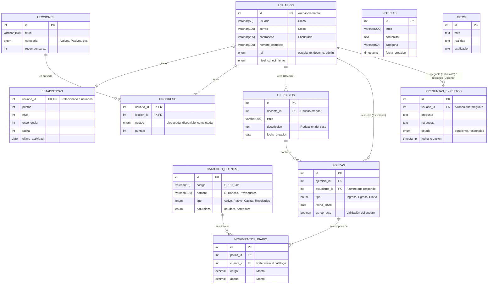

#### 3.4.2.2.1. Diagrama de tablas

El siguiente diagrama Entidad-Relación (E-R) representa la estructura final de la base de datos de **DebiHaby**, incluyendo tanto las tablas actuales para la gestión de usuarios y teoría, como las nuevas entidades requeridas para el funcionamiento de los simuladores contables (catálogo de cuentas, libro diario, etc.).

**Descripción de las Entidades Principales:**

- **USERS y USER_STATS:** Controlan el acceso a la plataforma (estudiantes, docentes, administradores) y almacenan las métricas de gamificación (puntos, nivel, racha).
- **LESSONS y USER_PROGRESS:** Administran el contenido teórico y registran qué lecciones ha desbloqueado o completado el alumno.
- **CATALOGO_CUENTAS (Nuevo):** El catálogo oficial de cuentas que utilizarán los alumnos para armar sus registros. Define la naturaleza y el tipo de cada cuenta para la automatización de reportes.
- **EJERCICIOS y POLIZAS (Nuevo):** Almacenan los casos prácticos redactados por los docentes y las respuestas enviadas por los estudiantes.
- **MOVIMIENTOS_DIARIO (Nuevo):** Registra cada transacción individual (el cargo o el abono a una cuenta específica) que conforma la póliza de un estudiante, permitiendo calcular automáticamente si cuadra la partida doble.
- **NEWS, MYTHS y EXPERT_QUESTIONS:** Gestionan el contenido complementario informativo y el sistema de asesorías personalizadas de la plataforma.
